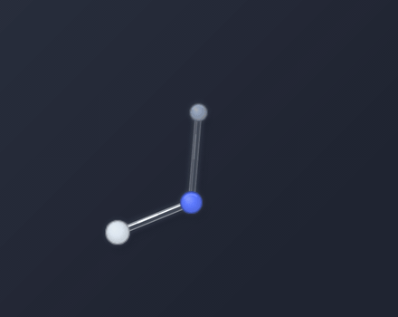
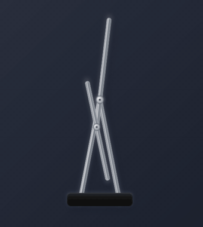

# 키네틱 데스크

화면 한쪽에 띄워 두는 투명 이중 진자입니다. 창 프레임은 없고, 오브제만 보입니다.

macOS용. 로그인도 서버도 없고, 아무것도 수집하지 않습니다.

<p>
  
  
</p>

왼쪽이 추 진자, 오른쪽이 막대 진자입니다. 초기값이 아주 조금만 달라도 몇 초 뒤엔
완전히 다른 궤적을 그리므로, 볼 때마다 다릅니다.

## 설치

[Releases](https://github.com/jwk1413/kinetic-desk/releases)에서 받으세요.

| | 파일 | 비고 |
|---|---|---|
| macOS | `KineticDesk-1.0.0-mac-arm64.dmg` | Apple Silicon(M 시리즈) 전용 |
| Windows | `KineticDesk-Setup-1.0.0-x64.exe` | 64비트 |

### macOS

`응용 프로그램`으로 옮긴 뒤 처음 열면 **"손상되었기 때문에 열 수 없습니다"** 가 뜹니다. 앱이 손상된 게 아니라, Apple 공증(연 $99)을 받지 않아서 macOS가 막는 것입니다. 터미널에 아래 한 줄을 붙여넣으면 풀립니다.

```bash
xattr -dr com.apple.quarantine "/Applications/키네틱 데스크.app"
```

우클릭 → 열기로는 풀리지 않습니다. 최근 macOS에서는 위 명령이 필요합니다.

### Windows

설치 파일을 실행하면 **"Windows의 PC 보호"** 경고가 뜹니다. 코드 서명 인증서가 없어서입니다. **추가 정보 → 실행**을 누르면 설치됩니다.

> **Windows 빌드는 실제 Windows에서 검증하지 못했습니다.** 개발과 테스트를 모두 macOS에서만 했습니다.
> 빌드는 정상이고 코드에 Windows 분기도 있지만 실제 동작은 확인되지 않았습니다.
> 문제가 있으면 [이슈](https://github.com/jwk1413/kinetic-desk/issues)로 알려주세요.

## 조작

메뉴 막대(Windows는 작업 표시줄)의 진자 아이콘에서 모든 설정을 바꿉니다.

- **끌어서 옮기기** — 고정점이나 받침을 잡고 끕니다. 모니터 사이도 오갑니다.
- **던지기** — 추나 막대를 잡아 휘두르면 그대로 돕니다.
- **클릭 통과** — 켜면 모든 클릭이 뒤쪽 작업 창으로 지나갑니다. 끌 때는 메뉴 막대 아이콘 또는 `⌘⌥P`.
- **계속 흔들기** — 끄면 저절로 느려지다 멈춥니다.

모양(추 진자·막대 진자), 진자 수(1~3중), 크기, 속도, 프레임, 잔상, 옮길 때 흔들리기를 고를 수 있습니다. 설정은 저장됩니다.

## 알아두실 것

- **용량이 100MB대입니다.** Electron 기반이라 그렇습니다. 메모리는 실행 중 200MB대를 씁니다. 진자 하나치고 큰 건 맞고, 숨기지 않고 적어둡니다.
- 클릭 통과 중에는 창을 눌러서 돌아올 수 없습니다. 메뉴 막대(Windows는 작업 표시줄)나 `⌘⌥P`(Windows는 `Ctrl+Alt+P`)를 쓰세요.
- 게임이 쓰는 완전 독점 전체 화면에는 가려질 수 있습니다. 잠금 화면 위에는 그릴 수 없습니다.
- 픽셀 단위 창 모양은 OS가 지원하지 않아, 오브제 위일 때만 클릭을 받도록 흉내 냅니다. 경계에서 한 프레임 정도 지연이 있을 수 있습니다.
- macOS 빌드는 **Apple Silicon(M 시리즈) 전용**입니다. Intel 맥에서는 실행되지 않습니다.

## 직접 빌드하기

```bash
npm install
npm run dev     # 개발 실행
npm test        # 타입 검사 + 테스트 5종
npm run dist     # macOS dmg 빌드
npm run dist:win # Windows 설치 파일 빌드
```

## 구조

이후 모빌 같은 오브제를 넣기 쉽도록 역할을 나눠 두었습니다.

- `src/main` — 투명 창, 항상 위, 클릭 통과, 메뉴 막대
- `src/renderer/src/physics` — n중 진자 운동방정식과 적분
- `src/renderer/src/render` — 2.5D 그리기
- `src/renderer/src/objects` — 오브제 구현
- `src/shared` — 창과 렌더러가 공유하는 상태

진자는 Lagrange 운동방정식을 질량 행렬로 풀고 RK4로 적분합니다. 감쇠를 끄면 한 시간을 돌려도 총 에너지가 0.07% 안에서 유지됩니다.

## 라이선스

MIT. 이 프로젝트는 어떤 상용 키네틱 조각 제품과도 관련이 없습니다.
